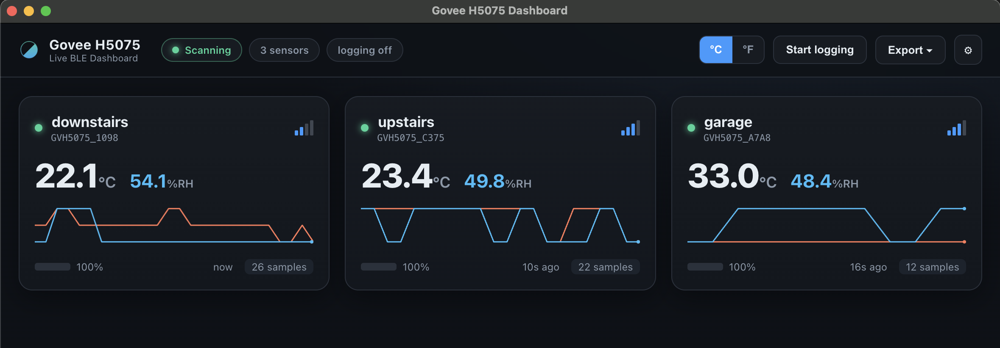
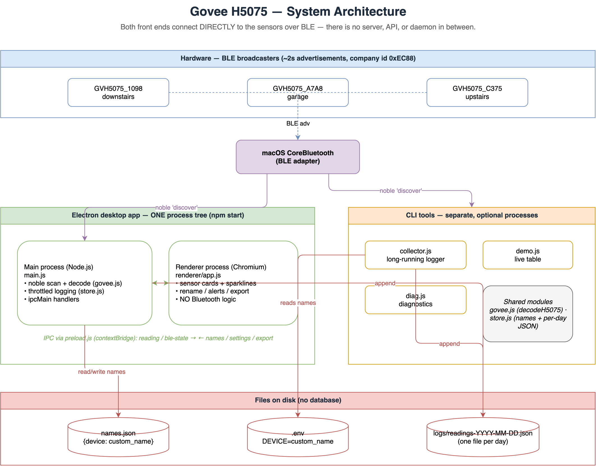
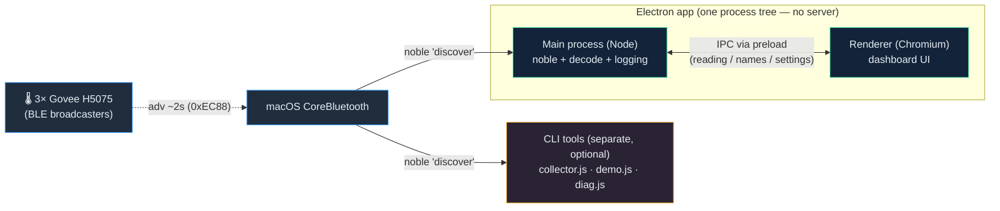

```
  _____                       _    _ _____  ___ ______ _____
 / ____|                     | |  | | ____|/ _ \____  | ____|
| |  __  _____   _____  ___  | |__| | |__ | | | |  / /| |__
| | |_ |/ _ \ \ / / _ \/ _ \ |  __  |___ \| | | | / / |___ \
| |__| | (_) \ V /  __/  __/ | |  | |___) | |_| |/ /   ___) |
 \_____|\___/ \_/ \___|\___| |_|  |_|____/ \___//_/   |____/

 _
| |
| |     ___   __ _  __ _  ___ _ __
| |    / _ \ / _` |/ _` |/ _ \ '__|
| |___| (_) | (_| | (_| |  __/ |
|______\___/ \__, |\__, |\___|_|
              __/ | __/ |
             |___/ |___/
```

<p align="center">
  <b>Passive Bluetooth logger for Govee H5075 temperature &amp; humidity sensors — built for macOS / Apple Silicon.</b>
</p>

<p align="center">
  
  
  
  
  
</p>

---

Reads **temperature, humidity, and battery** from one or more **Govee H5075** hygrometers by passively listening to their Bluetooth Low Energy (BLE) advertisement broadcasts. No pairing, no Govee app, no cloud, and **zero extra battery drain** on the sensors — it just overhears what they already shout every ~2 seconds.

Built with Node.js + [`@abandonware/noble`](https://github.com/abandonware/noble), which speaks to Apple's CoreBluetooth directly. See [`SPEC.md`](SPEC.md) for the full design and BLE decode reference.

## ✨ Features

- 📡 **Passive sniffing** — reads BLE advertisements; never connects, never drains sensors.
- 🏷️ **Name-based identity** — filters by advertised name (`GVH5075_*`), the only reliable ID on macOS, which hides MAC addresses.
- 🔢 **Verified decode** — Govee manufacturer payload (`0xEC88`) → °C / °F, %RH, battery %.
- 🗂️ **Per-day JSON logs** — one tidy `logs/readings-YYYY-MM-DD.json` per day, with local timestamps.
- 🛏️ **Friendly names** — map each sensor to a room via an optional `.env` (e.g. `downstairs`, `garage`).
- 🩺 **Built-in diagnostics** — a wide-net scanner to track down a weak or missing sensor.
- ⏱️ **Smart throttling** — one logged reading per device per minute (configurable).
- 🖥️ **Desktop app** — an optional Electron dashboard with live cards, in-app renaming, charts, threshold alerts, and exports (see [below](#️-desktop-app-electron)).

## 🚀 Quick start

```bash
cd node
npm install
node demo.js          # live table — proves every sensor is being read
```

Then start logging:

```bash
node collector.js     # appends to ../logs/readings-<today>.json ; Ctrl-C to stop
```

> [!IMPORTANT]
> **Turn Bluetooth on**, and grant **Bluetooth permission to your terminal app**
> (System Settings → Privacy & Security → Bluetooth → enable Terminal / iTerm2 / VS Code).
> Without permission, scans return zero devices with *no error*.

## 🖥️ The live demo

`demo.js` prints an auto-updating table of every sensor it hears and declares success once they've all reported:

```
Govee H5075 BLE read demo — proving sensor reads on this Mac

Scanning… 3/3 sensor(s) found   (elapsed 31s)

  DEVICE          TEMP              HUMIDITY   BATTERY  RSSI    SAMPLES  LAST
  GVH5075_1098    22.4°C / 72.3°F   48.9%      100%     -65     14       now
  GVH5075_A7A8    30.4°C / 86.7°F   48.0%      100%     -64     12       2s ago
  GVH5075_C375    23.0°C / 73.4°F   52.0%      100%     -82     9        4s ago

✅ SUCCESS — read all 3 sensors. Streaming live; Ctrl-C to stop.
```

```bash
node demo.js          # expects 3 sensors
node demo.js 2        # expect a different number
```

## 🖼️ Desktop app (Electron)

A polished GUI alternative to the CLI — a live dashboard with sensor cards, in-app renaming, charts, alerts, and exports.



```bash
cd electron
npm install
npm start            # launch the dashboard
```

**Stopping:** quit the app normally (⌘Q / close the window). Logging is a toolbar toggle — turn it off without quitting, or leave it on across restarts (the setting persists).

**What it does:**

- 📇 **Live sensor cards** — temperature, humidity, battery, and signal bars updating in real time, with online/offline status and "last seen" age.
- ✏️ **Manage custom names** — click a sensor's name to rename it inline; saved to `names.json` and usable by the CLI via **Export ▾ → Sync names → .env**.
- 📈 **Live sparklines** — rolling temp & humidity history drawn per card.
- 🌡️ **°C / °F toggle** — switch units app-wide instantly.
- 🚨 **Threshold alerts** — set high/low temp, humidity, and low-battery limits in Settings; offending cards highlight and a toast fires.
- 💾 **One-click export** — session readings to CSV or JSON, or open the log folder.
- 📝 **Built-in logging** — toggle per-day JSON logging (same format as the CLI) straight from the toolbar.

`names.json` is git-ignored (personal, like `.env`) and is seeded from your `.env` on first run, so the GUI and CLI stay in sync.

### 📦 Building installers (.dmg / .exe)

The dashboard packages into native installers with [electron-builder](https://www.electron.build/).

```bash
cd electron
npm install
npm run dist:mac     # → electron/dist/*.dmg   (build on macOS)
npm run dist:win     # → electron/dist/*.exe   (build on Windows)
```

- **Native modules can't be cross-built** — build the macOS app on a Mac and the Windows app on Windows. The included GitHub Actions workflow ([`.github/workflows/build-desktop.yml`](.github/workflows/build-desktop.yml)) builds **both** on their own runners: push a version tag (`git tag v1.0.0 && git push --tags`) and the `.dmg` + `.exe` are attached to a GitHub Release. You can also trigger it manually from the Actions tab.
- **Unsigned builds** run on your own machines but show a Gatekeeper (macOS) / SmartScreen (Windows) warning on first launch — right-click → Open (Mac) or "More info → Run anyway" (Windows). Distributing without warnings needs an Apple Developer cert and/or a Windows code-signing cert; the build config has a clear spot to add them later.
- When packaged, logs and `names.json` live in the per-user app-data folder (macOS: `~/Library/Application Support/govee-h5075-desktop/`), since the app bundle itself is read-only.

## 📂 Project layout

```
5075-bt-reader/
├── README.md
├── SPEC.md                  # full design & BLE decode reference
├── .env.example             # template for naming your sensors
├── node/                    # CLI tools
│   ├── demo.js              # proof-of-concept: live per-device table
│   ├── collector.js         # long-running logger → per-day JSON
│   ├── diag.js              # diagnostic scan (find a missing/weak sensor)
│   ├── govee.js             # shared H5075 decoder
│   ├── store.js             # shared persistence (names, per-day JSON, timestamps)
│   └── package.json
├── electron/                # desktop dashboard
│   ├── main.js              # main process: BLE scan + IPC + logging
│   ├── preload.js           # contextBridge IPC
│   ├── smoke.js             # headless self-test (noble loads under Electron)
│   ├── renderer/            # index.html · styles.css · app.js
│   └── package.json
├── diagrams/                # Mermaid (.mmd) + editable draw.io source
├── docs/images/             # rendered diagrams & screenshots
└── logs/                    # generated at runtime: readings-YYYY-MM-DD.json
```

## 🏗️ Architecture — what runs behind the Electron app

**The desktop app talks to the sensors directly over Bluetooth. There is no background API, web server, or daemon — and it does *not* depend on `collector.js` running.**

When you run `npm start`, Electron launches **one application** made of two parts:

- **Main process (Node.js)** — loads `@abandonware/noble`, which speaks to macOS **CoreBluetooth**, scans for BLE advertisements, decodes them with `govee.js`, and (if logging is on) writes per-day JSON with `store.js`.
- **Renderer process (Chromium)** — the dashboard UI. It holds **no** Bluetooth logic; it only receives decoded readings from the main process over a secured **IPC** channel (via `preload.js`) and sends back actions like rename/settings/export.

The CLI tools (`demo.js`, `collector.js`, `diag.js`) are **separate, optional programs** that connect to the same sensors the same way. You can run the GUI, a CLI tool, or both — just avoid running two *loggers* into the same `logs/` folder at once.





> **Native module note:** noble is an N-API addon (`napi_versions: [4]`), which is ABI-stable across both Node.js and Electron — so the same prebuilt binary works in the CLI and the GUI with **no `electron-rebuild` step**.

### Diagrams

More detailed diagrams live in [`diagrams/`](./diagrams/) as Mermaid `.mmd` files (they render natively on GitHub):

| Diagram | Description |
|---------|-------------|
| [Architecture overview](./diagrams/architecture-overview.mmd) | All components: GUI, CLI, shared modules, and files — and how each reaches the sensors. |
| [Electron process model](./diagrams/electron-process-model.mmd) | What's actually running: main + renderer in one app, no API/daemon. |
| [Electron IPC sequence](./diagrams/electron-ipc-sequence.mmd) | Lifecycle of a reading and a rename across CoreBluetooth → main → renderer. |
| [BLE decode pipeline](./diagrams/ble-decode-pipeline.mmd) | How a raw advertisement is filtered and decoded into a reading object. |
| [Custom-name data flow](./diagrams/names-data-flow.mmd) | How `names.json` and `.env` relate and stay in sync. |

> **Viewing locally:** use the [Mermaid Live Editor](https://mermaid.live) or the VS Code "Markdown Preview Mermaid Support" extension.

## 📝 Log format

`collector.js` appends one reading per device per 60 s to `logs/readings-<local-date>.json` — a valid JSON array, written atomically so a crash never corrupts it:

```json
{
  "timestamp_local": "2026-06-25 21:10:32",
  "date": "2026-06-25",
  "time": "21:10:32",
  "epoch": 1782436232,
  "device_name": "GVH5075_C375",
  "custom_name": "upstairs",
  "temp_c": 23.2,
  "temp_f": 73.76,
  "humidity_pct": 51.1,
  "battery_pct": 100,
  "rssi": -82
}
```

## 🏷️ Naming your sensors

Each reading includes a `custom_name`, defaulting to the raw advertised name (e.g. `GVH5075_1098`). To map your sensors to rooms:

1. Run `node demo.js` to discover your device names (they look like `GVH5075_XXXX`).
2. Copy the template and edit it:
   ```bash
   cp .env.example .env
   ```
   ```ini
   # .env  (format: <device_name>=<custom_name>)
   GVH5075_1098=downstairs
   GVH5075_A7A8=garage
   GVH5075_C375=upstairs
   ```

`.env` is optional and **git-ignored**, so your personal setup stays out of the repo. Any device not listed falls back to its raw name. Change logging frequency via `SAMPLE_INTERVAL_MS` in `node/collector.js` (default `60_000` ms).

## ♾️ Running it persistently

Keep it running across terminal close / crashes with [pm2](https://pm2.keymetrics.io/):

```bash
cd node
pm2 start collector.js --name govee-logger
pm2 save
pm2 logs govee-logger      # tail output ;  pm2 stop govee-logger to halt
```

> [!WARNING]
> **Two macOS gotchas for an always-on logger:**
> 1. **BLE scanning halts when the Mac sleeps.** Keep it awake on power
>    (`sudo pmset -c sleep 0`) or run under caffeinate:
>    `pm2 start caffeinate --name govee-logger -- -is node collector.js`
> 2. **Bluetooth permission is per host app.** A pm2/launchd process started at
>    boot may not inherit your terminal's permission. If a boot-started logger
>    writes nothing, start it from your already-permitted terminal and use
>    `pm2 save` / `pm2 resurrect`. Confirm with `pm2 logs govee-logger`.

## 🩺 Diagnostics

A sensor not showing up? `diag.js` casts a wider net — any Govee-family name and any `0xEC88` advertiser, with raw bytes and RSSI range:

```bash
node diag.js          # default 180s ; node diag.js 300 for 5 min
```

| Symptom | Likely cause / fix |
|---------|--------------------|
| Zero devices, no error | Bluetooth off, or terminal lacks Bluetooth permission. |
| Only some sensors appear | A missing unit is out of range / weak signal — move it closer or run `diag.js` longer. |
| `DECODE FAILED` in diag | Firmware variant — compare the raw bytes against `SPEC.md` §2. |
| Logging stops overnight | Mac went to sleep — see the persistence gotchas above. |

## 🔧 Requirements

- macOS (Apple Silicon supported), Node.js 18+ (tested on Node 25).
- Xcode Command Line Tools (`xcode-select --install`).
- Bluetooth on, and Bluetooth permission for your terminal app.

## 📚 Notes

- A Python (`bleak`) backup implementation is described in [`SPEC.md`](SPEC.md) §7 as a proven macOS fallback.
- The name-based identity scheme means the collector runs **unchanged on Linux / Raspberry Pi**, making it easy to graduate from "laptop demo" to a 24/7 gateway.
- `logs/`, `node_modules/`, `.env`, and `*.tmp` are git-ignored.
